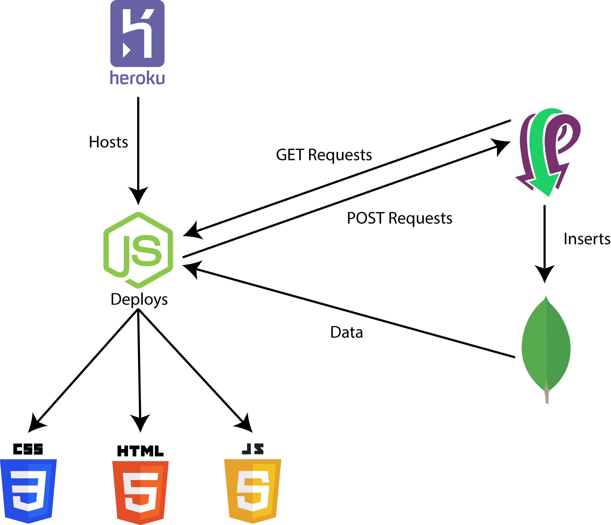
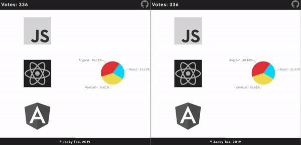
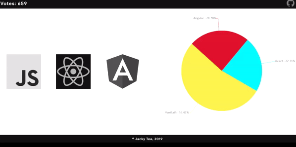

# Real Time Polling Application

## Overview
Visit the site [here.](https://sheltered-inlet-92987.herokuapp.com/ "Real Time Polling Application") **(Note: Site may take a while to connect to due to Heroku putting idle apps into a 'sleep' mode)**

A real time polling application utilizing [CanvasJS](https://canvasjs.com/ "CanvasJS Homepage") and [Pusher](https://pusher.com/ "Pusher Homepage") to push data in real time to a javascript generated graph. The application is served locally by a Node.js server and hosted by [Heroku](https://www.heroku.com/ "Heroku Homepage"). Votes are saved in a [MongoDB](https://www.mongodb.com/ "MongoDB Homepage") database for data persistence.

## Schematic
 

## Demonstration GIFS

Having two windows open, they both update the polling chart in real time without the need to refresh the webpage.

 

A full screen demo of the app.

 